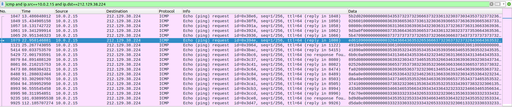

# Day 02 - Wrapped Packet

## Challenge
According to our information, one of our auditors' workstations has been compromised, and some even claim that data has been exfiltrated. Here's a network capture from the suspected workstation. Can you confirm the diagnosis made by our experts?

>    Author: Mika

## Inputs
- PCAL file: [chall.pcapng](./chall.pcapng)

## Analysis
We see some weird `ICMP` traffic with piggybacked data:



Let's extract it and make sense out of it

## Solution
We extract the `ICMP` data using `tshark` as follow:
```console
$ tshark -r chall.pcapng -O icmp -Y 'ip.src==10.0.2.15 and ip.dst==212.129.38.224' -T fields -e data.data | grep '000000' > packets.txt
```

We can make sense out of it by `unhexlifying` it twice using following python code:

```python
from binascii import unhexlify

data = ''
with open("packets.txt", "r") as f:
    for line in f:
        a = unhexlify(line.strip()[16:].replace('00', ''))[0:16]
        b = unhexlify(a).decode()
        data += b

print(data)
```

Here's the output:

```console
$ python3 sol.py
Error: ping: invalid argument: 'www.root-me.org'


PRETTY_NAME="Kali GNU/Linux Rolling"
NAME="Kali GNU/Linux"
VERSION_ID="2024.3"
VERSION="2024.3"
VERSION_CODENAME=kali-rolling
ID=kali
ID_LIKE=debian
HOME_URL="https://www.kali.org/"
SUPPORT_URL="https://forums.kali.org/"
BUG_REPORT_URL="https://bugs.kali.org/"
ANSI_COLOR="1;31"
"Hey you found me! Well done!one!RM{M3rry_Chr1stM4s_R00T-M3}
M3}
```

## Python code
Complete solution in [sol.py](./sol.py)

## Flag
> RM{M3rry_Chr1stM4s_R00T-M3}
