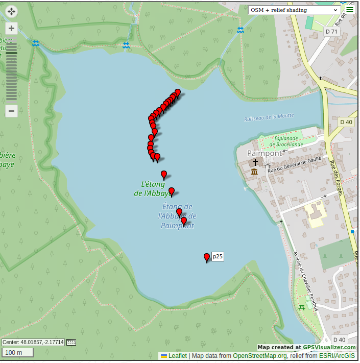
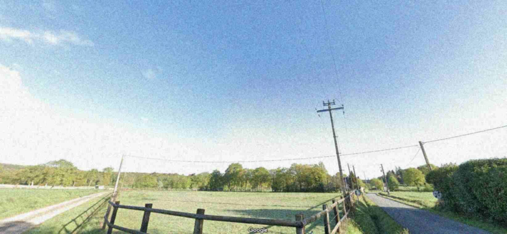
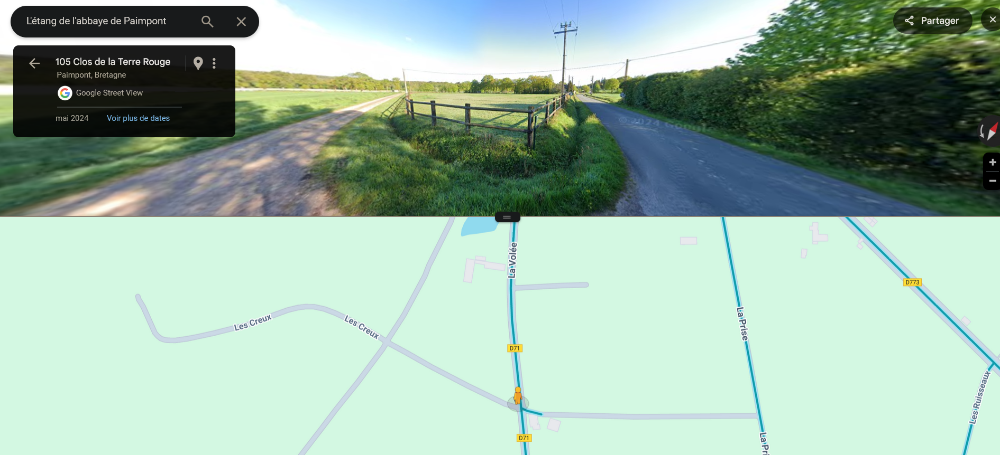

# Day 13 - The lost gift

## Challenge
I couldn't wait and opened one of my christmas presents in advance, my very first FPV drone, I had been eagerly waiting for it. I decided to try it outside, conditions were perfect: sunny, no wind and a safe spot for a maiden flight.

However, shortly after takeoff, my drone flied straight ahead and stopped responding to any of my commands. I saw it disappear in a distance, soaring over the trees, completely out of control. I forgot to activate the FailSafe mode...

Fortunately, I still have the last coordinates from the beacon signal transmitted via Wi-Fi and the last image captured by the video feed.

Could you use these clues to locate my drone?

>    - Flag: RM{streetnamewherethedronelanded}
>    - Example: RM{ruedelapaix}
>    - Author: Chic0s

## Inputs
- PCAP file: [beacon.pcap](./beacon.pcap)
- Last video frame: [FRAME10574.jpg](./FRAME10574.jpg)

## Extract GPS coordinates
Looking at the `PCAP` file, we see `GPS coordinates` being transmitted over WiFi. We can extract then using `tshark` as follow:

```console
$ tshark -r beacon.pcap -O 802.11 -T fields -e wlan.vs.sgdsn.tag.gpscoord
4802088,-217719
4802078,-217733
4802073,-217740
4802064,-217751
4802060,-217758
4802054,-217768
4802046,-217779
4802036,-217795
4802029,-217809
4802020,-217821
4802013,-217829
4802001,-217825
4801993,-217821
4801977,-217815
4801960,-217829
4801941,-217831
4801929,-217833
4801918,-217829
4801909,-217821
4801906,-217804
4801858,-217776
4801811,-217744
4801751,-217711
4801727,-217692
4801625,-217596
```

## Map the GPS coordinates
We plot the GPS coordinates in https://www.gpsvisualizer.com for instance, where we need to input them as follow:

```
$ cat coords.txt
latitude,longitude,elevation,name
48.02088,-2.17719,0,p1
48.02078,-2.17733,0,p2
48.02073,-2.17740,0,p3
48.02064,-2.17751,0,p4
48.02060,-2.17758,0,p5
48.02054,-2.17768,0,p6
48.02046,-2.17779,0,p7
48.02036,-2.17795,0,p8
48.02029,-2.17809,0,p9
48.02020,-2.17821,0,p10
48.02013,-2.17829,0,p11
48.02001,-2.17825,0,p12
48.01993,-2.17821,0,p13
48.01977,-2.17815,0,p14
48.01960,-2.17829,0,p15
48.01941,-2.17831,0,p16
48.01929,-2.17833,0,p17
48.01918,-2.17829,0,p18
48.01909,-2.17821,0,p19
48.01906,-2.17804,0,p20
48.01858,-2.17776,0,p21
48.01811,-2.17744,0,p22
48.01751,-2.17711,0,p23
48.01727,-2.17692,0,p24
48.01625,-2.17596,0,p25
```

So we see that the drone was flying above the `Etang de l'abbaye de Paimpont`, going south east:



## Find the drone
Now we need to look at the last transmitted video frame:



And look around south east in `Google Maps`, to finally spot the correct location:



So the drone has landed at `Clos de la terre rouge`.

## Flag
> RM{closdelaterrerouge}
